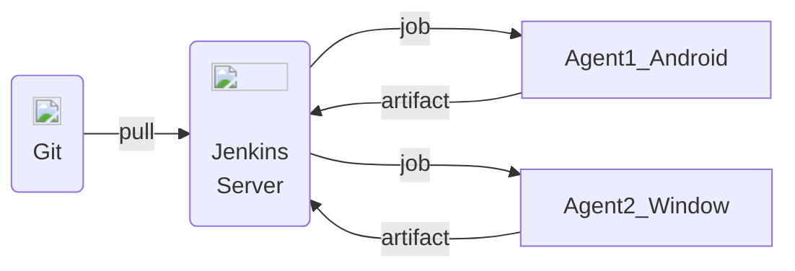

# 구성을 어떻게??

Git 서버에 올라와있는 프로젝트를 기반으로 Jenkins를 구성하려고 한다.



# Docker-Jenkins 설정

Docker는 설치되어 있는 걸로 가정한다.


1. Jenking Docker 이미지 pull 및 Container 실행

    ```sh
    docker pull jenkins/jenkins
    # Port number (-p option value) can be editable. 
    docker run -p 8080:8080 -v /var/jenkins_home jeknins/jenkins
    ```

2. Jenkins 기본 설정

    맨 처음에는 localhost:8080 (포트 부분은 설정에 따라 달라진다.) 에서 기본적인 설정을 하면 된다.
  
    아래 영상은 Window 환경이지만 브라우저 내에서 하니 과정 자체는 비슷하다고 할 수 있다.

    <iframe width="560" height="315" src="https://www.youtube.com/embed/cy2257Y7I54?si=e0CyAblieKcMVfRS&amp;start=1081" title="YouTube video player" frameborder="0" allow="accelerometer; autoplay; clipboard-write; encrypted-media; gyroscope; picture-in-picture; web-share" allowfullscreen></iframe>

3. Plugin 설치

    Unity 자동 빌드를 위한 Plugin (Unity3d)를 설치하고 Tools에 Unity 등록을 해야됨
    - Agent Node를 활용하여 잡을 구설할 경우 Master node에서는 Installation Directory를 비워놓으면 된다. 나는 Master-Agent를 구성할 것이기 때문에 비워둔채로 진행한다.

    

4. Project 추가 및 구성

    Dashboard로 돌아가 "New Item"을 추가한 후 "Freestyle project"를 추가한다. 내가 설정한 부분만 나열해보겠다. (언급 안된곳은 안건드림.)

    - <b>Source Code Management:</b> 본인의 Git repository URL 입력, Credential은 해당 Git 서비스의 (gitlab, github 등등) 계정을 입력하면 된다.
    - <b>Build Triggers:</b> 취향 껏 고르면 된다. gitlab을 사용하기에 github Webhook을 사용할 수 있을지는 모르겠다. 필자는 periodical로 두었고 H H * * * (매일 맨 처음 설정한 시간에 빌드)를 빌드 시간으로 두었다.
    - <b>Build Steps:</b> Invoke Unity3d를 선택해도 되고, Execute shell script를 사용하여도 된다. 허나 지금 젠킨스 내부에서 파라미터를 어떻게 구성하는지를 몰라 shell script를 실행하는 것으로 설정하였다.
    - <b>Post-build Action:</b> Archive artifacts를 설정해 빌드 후 파일을 다운로드 받을 수 있도록 설정한다.

Master 노드의 세팅은 얼추 끝났고 Agent 노드를 설정해야 된다. 

# Agent Node 설정

1. Master Node에서 Manage Jenkins -> Nodes -> New Nodes를 클릭하고 새로운 노드를 세팅한다.
2. <b>Remote root directory:</b> Agent Node에서 root 디렉토리가 될 곳을 입력한다.
3. <b>Usage:</b> 필자는 "Only build jons with label expression matching this node"를 선택했다. 
4. <b>Node Properties:</b> Tool locations을 클릭 후 Unity Path를 입력해야 한다. Unity는 Master node에 입력했던 정보가 나타나고, 해당 레이블에 맞는 유니티를 실행시키기 위해 Agent node의 Unity 실행 path를 입력하면 된다.
5. 이후 Save를 하면, icon이 x 모양인 채로 노드가 등록이 되는데 해당 노드를 클릭하면 Agent node의 쉘에 스크립트를 돌리라고 나온다. 해당 스크립트들을 2번의 Remote root directory에서 실핸시키면 된다.
   1. 만약 Agent에서 Connection Refused가 발생하면, Websocket 옵션을 키면 되는 것 같다.
   

